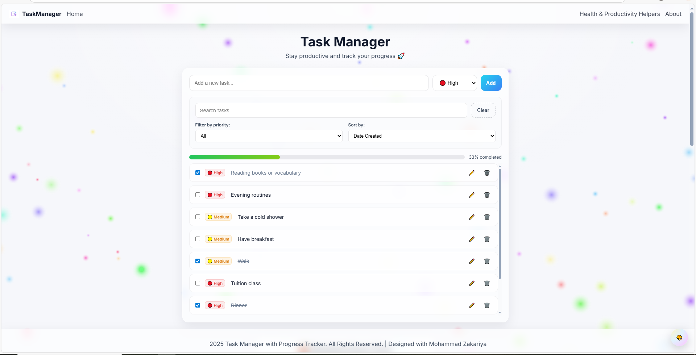
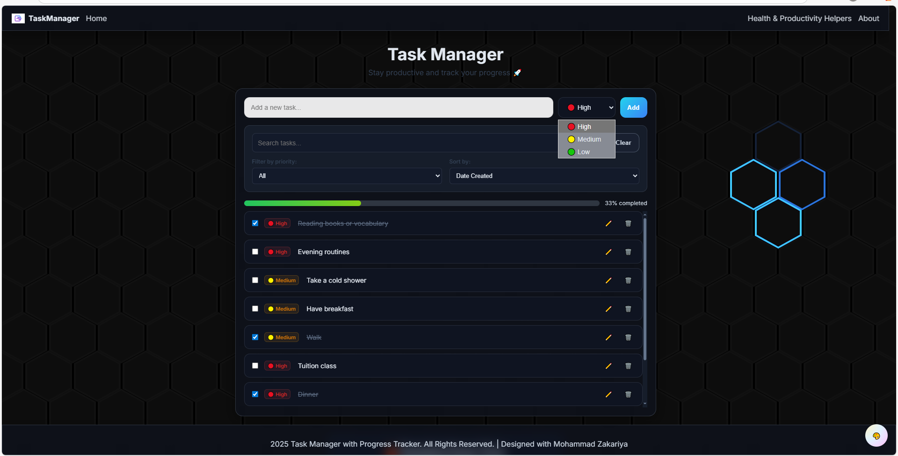
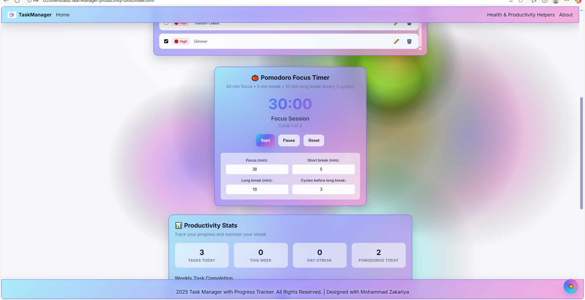
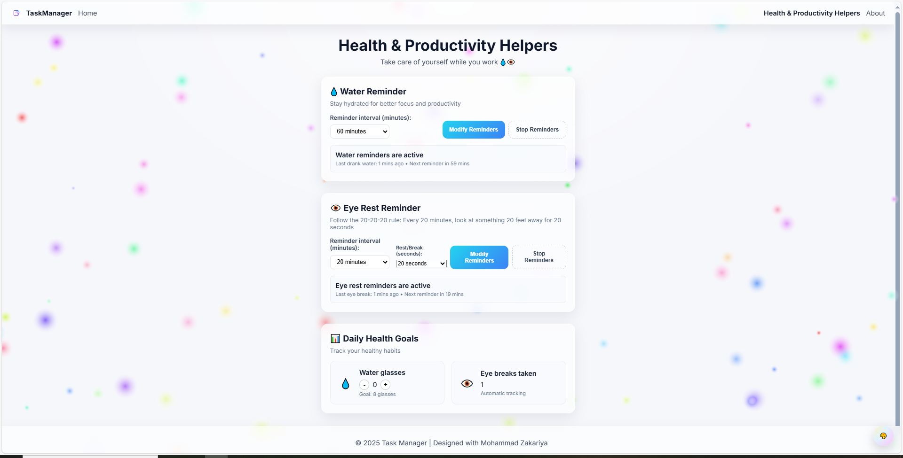

# Task-Manager-productivity-tools
A web app with task manager, Pomodoro timer, productivity stats, water &amp; eye rest reminders.

# 📝 Task Manager & Productivity App  

  
  
  

A modern and lightweight productivity web app designed to keep you focused and organized.  
It combines a **task manager, Pomodoro timer, productivity stats, water & eye rest reminders, and theme system** — all in one place.  

---

## ✨ Features
- ✅ **Task Managerc** – Add, edit, delete, and mark tasks as complete  
- ⏱ **Pomodoro Focus Timer** – Stay focused using the Pomodoro technique  
- 📊 **Productivity Stats** – Visualize your completed tasks & progress  
- 💧 **Water Reminder** – Stay hydrated during work sessions  
- 👀 **Eye Rest Reminder** – Reduce screen fatigue with timely breaks  
- 🎨 **Theme Switcher** – Light, Dark, and Multicolor Aurora themes  

---

## 📂 Project Structure
```bash
Task-Manager-productivity-tools/
│
│── index.html           # Main landing/home page
│── about.html           # About page
│── health.html          # Health-related reminders page
│── styles.css           # Main styles for the website
│── darktheme.css        # Dark theme styles
│── script.js            # JavaScript functionality
│── Logo/                # Folder for logos & icons
│ 
│── Screenshots/         # Folder for project screenshots
│    
└──README.md             # Project documentation


```
---

## 🛠️ Tech Stack
- **Frontend:** HTML5, CSS3, JavaScript (Vanilla)
- **Version Control:** Git & GitHub
- **Deployment:** GitHub Pages

---

## 🚀 Getting Started
**1.Clone the repository**
```
git clone https://github.com/YourUsername/task-manager-app.git
```

**2.Open the project**
- Open index.html in your browser
- Or use VS Code Live Server for better development experience

---

## 📸 Screenshots
Below are key screens from the app. Images are stored in screenshots/.

### Home




### Health & Productivity Helpers


---

## 🤝 Contributing

### Contributions are welcome!
- Fork this repository
- Create a feature branch (git checkout -b feature-name)
- Commit your changes (git commit -m "Add feature")
- Push to branch (git push origin feature-name)
- Create a Pull Request

---

## 📧 Contact

### 👨‍💻 Author: Mohammad Zakariya
### 📩 Email: mzakariya23@gmail.com
### 🌐 GitHub: [@KingMZ01](https://github.com/KingMZ01)

---

## 📜 License

This project is licensed under the **MIT License.**

You are free to use, modify, and distribute this software.
